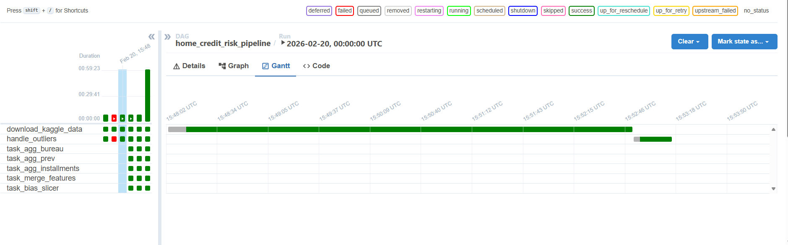
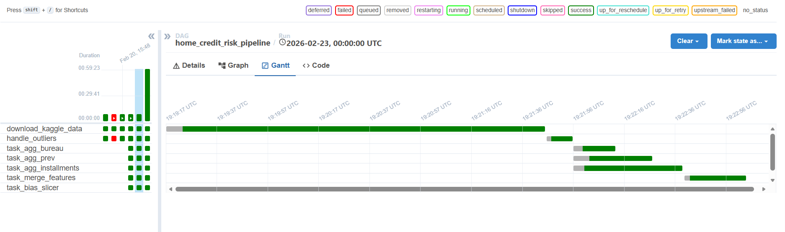
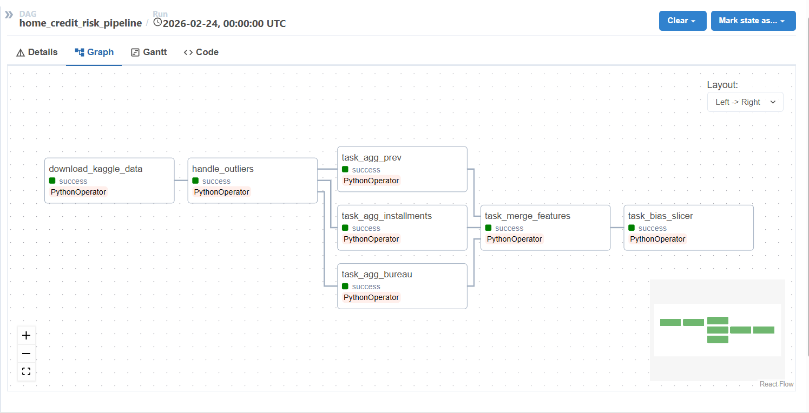

# ShiftHappens - Data Pipeline

## Overview
This repository contains the Airflow data pipeline for ShiftHappens. The pipeline automates the ingestion, preprocessing, validation, and bias detection for the Home Credit Default Risk dataset.

## Repository Structure
* `dags/`: Contains the Apache Airflow DAG definitions (`home_credit_pipeline.py`).
* `data/`: Local directory for storing raw and processed datasets (tracked via DVC).
* `scripts/`: Modular Python scripts for downloading, cleaning, feature engineering, and bias slicing.
* `tests/`: Unit tests (using pytest) to ensure robustness of preprocessing steps.
* `logs/`: Airflow and application execution logs.
* `dvc.yaml`: Configuration for Data Version Control.

## Environment Setup & Reproducibility
To replicate this pipeline on another machine, ensure you have Python 3.9+ installed and follow these steps:

Clone the repository:
```bash
git clone https://github.com/semwalhritvik/shift-happens.git
cd shift-happens/Data-Pipeline
```

Create and activate a virtual environment:
```bash
python -m venv venv
source venv/bin/activate  # On Windows: venv\Scripts\activate
```

Install dependencies:
```bash
pip install -r requirements.txt
```

Pull versioned data with DVC:
This project uses DVC to track the dataset. To pull the exact data versions used in this pipeline:
```bash
dvc pull
```

## Running the Airflow Pipeline
This pipeline is orchestrated using Apache Airflow.

Initialize the Airflow database and setup:
```bash
export AIRFLOW_HOME=$(pwd)
airflow db init
airflow users create --username admin --password admin --firstname Admin --lastname User --role Admin --email admin@shifthappens.local
```

Start the Airflow Scheduler and Webserver:
Open two separate terminal windows.

Terminal 1:
```bash
airflow scheduler
```

Terminal 2:
```bash
airflow webserver -p 8080
```

Trigger the DAG:
Navigate to http://localhost:8080 in your browser, log in, unpause the `home_credit_pipeline` DAG, and trigger it manually.


## Pipeline Orchestration & Optimization (Gantt Charts)
This pipeline is orchestrated using Apache Airflow. 
* **Before Optimization:** Initially, the pipeline processed our 8 relational tables (like `bureau.csv` and `installments_payments.csv`) sequentially. The Airflow Gantt chart revealed a massive bottleneck, with long tasks running one after the other.



* **After Optimization:** We refactored the Airflow DAG using bitshift operators to run these aggregations in parallel. As seen in the updated Gantt chart (saved in our repo), tasks like `aggregate_bureau` and `aggregate_installments` now run simultaneously on different workers. This parallelization drastically reduced the overall pipeline execution time.




## Feature Engineering
Because our dataset consists of a main application table and several historical behavior tables, we cannot feed raw relational data to a machine learning model. Our feature engineering pipeline groups a customer's historical data (using `SK_ID_CURR`) and calculates summary statistics. 
* **Features Created:** We generated `mean`, `max`, `min`, and `count` metrics for past loan amounts, late payments, and previous application statuses. 
* These newly aggregated "clues" are then joined back to the main `application_train` table, giving the model a rich, singular snapshot of the applicant's financial history.

## Anomalies & Outlier Treatment
We utilized TensorFlow Data Validation (TFDV) to generate schemas and catch anomalies. 
* **The Outlier:** During schema generation, we detected an impossible value of `365243` in the `DAYS_EMPLOYED` column across thousands of rows. 
* **The Treatment:** We **kept the rows but removed the erroneous value**. Deleting the entire row would result in a massive loss of valuable customer data. Instead, our `outlier_treatment.py` script replaces `365243` with `NaN`. In the subsequent pipeline step, these `NaN` values are imputed using the column median.

## Unit Testing
We adhere to Test-Driven Development (TDD) using `pytest`. The `tests/` directory contains unit tests validating our preprocessing logic. Specifically, `test_outlier_treatment.py` ensures that edge cases (like the `365243` employment days anomaly) are correctly transformed to `NaN` without altering valid data. 

## Bias Detection & Mitigation
We implement Fairlearn's `CorrelationRemover` as a pre-processing step. After slicing the data to detect performance disparities across demographic groups, this mitigation step mathematically removes the correlation between sensitive features (like gender) and financial features, ensuring equitable model performance.

## Data Versioning (DVC)
We use Data Version Control (DVC) to track our dataset changes. The raw and processed datasets inside the `data/` directory are tracked via `.dvc` files, and the pipeline stages are defined in `dvc.yaml`. Our DVC remote is configured for cloud storage (Google Drive/GCP), ensuring visible evidence of integration and allowing team members to sync data using `dvc pull`.